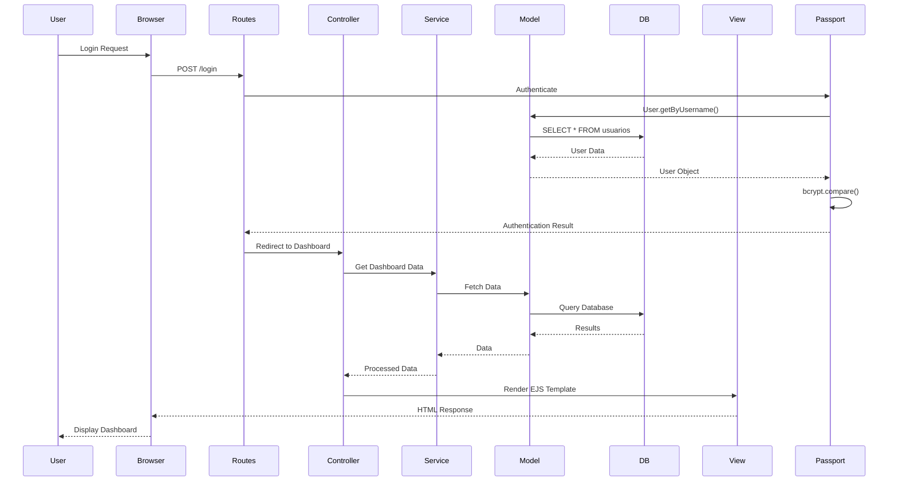

# REST_CAFE_BAR - System Architecture Diagram

## Overview
A restaurant management system built with Node.js/Express.js using MVC architecture with a service layer. The system handles user authentication, menu management, table operations, inventory control, and POS (Point of Sale) functionality.

## Architecture Diagram

```mermaid
graph TB
    subgraph "Client Layer"
        Browser[Web Browser]
        QR[QR Code Scanner]
    end

    subgraph "Server Layer - Express.js"
        App[app.js - Main Entry Point]
        
        subgraph "Middleware"
            Session[express-session]
            Passport[passport.js]
            Flash[connect-flash]
            Auth[auth.js - ensureAuthenticated]
            Multer[multer - File Upload]
        end
        
        subgraph "Routes Layer"
            AuthRoutes[authRoutes.js]
            AdminRoutes[adminRoutes.js]
            UserRoutes[userRoutes.js]
            POSRoutes[posRoutes.js]
            PedidoRoutes[pedidoRoutes.js]
            AlmacenRoutes[almacenRoutes.js]
            InventarioRoutes[inventarioRoutes.js]
            ProductoRoutes[productoRoutes.js]
        end
        
        subgraph "Controllers Layer"
            UserController[userController.js]
            MenuController[menuController.js]
            TableController[tableController.js]
            POSController[posController.js]
            PedidoController[pedidoController.js]
            AlmacenController[almacenController.js]
            InventarioController[inventarioController.js]
            DashboardController[dashboardController.js]
        end
        
        subgraph "Service Layer"
            UserService[userService.js]
            MenuService[menuService.js]
            OrderService[orderService.js]
            PedidoService[pedidoService.js]
            AlmacenService[almacenService.js]
            InventarioService[inventarioService.js]
            TableService[tableService.js]
            DashboardService[dashboardService.js]
        end
        
        subgraph "Models Layer"
            UserModel[userModel.js]
            MenuModel[menuModel.js]
            OrderModel[orderModel.js]
            PedidoModel[pedidoModel.js]
            AlmacenModel[almacenModel.js]
            InventarioModel[inventarioModel.js]
            TableModel[tableModel.js]
            ProductoModel[productoModel.js]
        end
    end

    subgraph "Data Layer"
        MySQL[(MySQL Database)]
        Config[config/db.js]
    end

    subgraph "View Layer - EJS Templates"
        AuthViews[auth/login.ejs]
        AdminViews[admin/*.ejs]
        POSViews[pos.ejs]
        InventoryViews[inventarios/*.ejs]
        UserViews[users/*.ejs]
    end

    subgraph "Static Assets"
        Public[public/ - CSS, JS, Images]
        Uploads[public/uploads/]
    end

    subgraph "Configuration"
        PassportConfig[config/passport.js]
        MulterConfig[config/multer.js]
        Env[.env]
    end

    %% Connections
    Browser -->|HTTPS| App
    QR -->|HTTPS| App
    
    App --> Session
    App --> Passport
    App --> Flash
    App --> Auth
    App --> Multer
    
    App --> AuthRoutes
    App --> AdminRoutes
    App --> UserRoutes
    App --> POSRoutes
    App --> PedidoRoutes
    App --> AlmacenRoutes
    App --> InventarioRoutes
    App --> ProductoRoutes
    
    AuthRoutes --> PassportConfig
    AuthRoutes --> UserController
    
    AdminRoutes --> UserController
    AdminRoutes --> MenuController
    AdminRoutes --> TableController
    AdminRoutes --> DashboardController
    
    UserRoutes --> UserController
    POSRoutes --> POSController
    PedidoRoutes --> PedidoController
    AlmacenRoutes --> AlmacenController
    InventarioRoutes --> InventarioController
    
    UserController --> UserService
    MenuController --> MenuService
    POSController --> MenuService
    POSController --> OrderService
    PedidoController --> PedidoService
    AlmacenController --> AlmacenService
    InventarioController --> InventarioService
    TableController --> TableService
    DashboardController --> DashboardService
    
    UserService --> UserModel
    MenuService --> MenuModel
    OrderService --> OrderModel
    PedidoService --> PedidoModel
    AlmacenService --> AlmacenModel
    InventarioService --> InventarioModel
    TableService --> TableModel
    
    UserModel --> Config
    MenuModel --> Config
    OrderModel --> Config
    PedidoModel --> Config
    AlmacenModel --> Config
    InventarioModel --> Config
    TableModel --> Config
    
    Config --> MySQL
    
    UserController --> AuthViews
    MenuController --> AdminViews
    POSController --> POSViews
    InventarioController --> InventoryViews
    UserController --> UserViews
    
    App --> Public
    Multer --> Uploads
    
    App --> Env
    Passport --> PassportConfig
    AdminRoutes --> MulterConfig
```

## Data Flow Diagram

## Module Descriptions

### Core Components

**app.js** - Main application entry point
- Configures Express.js middleware
- Sets up session management with Passport.js
- Mounts route handlers
- Creates HTTPS server with SSL certificates

**config/db.js** - Database connection pool
- MySQL connection using mysql2
- Connection pooling for performance

**config/passport.js** - Authentication strategy
- Local strategy for username/password authentication
- User serialization/deserialization for sessions

### Route Modules

**authRoutes.js** - Authentication endpoints
- `/login` - Login page and authentication
- `/logout` - Session termination

**adminRoutes.js** - Admin dashboard routes
- `/admin/dashboard` - Main dashboard
- `/admin/menu` - Menu management
- `/admin/mesas` - Table management

**posRoutes.js** - Point of Sale routes
- `/pos/:id_pedido` - POS interface
- `/api/pos/save` - Save order
- `/qr/:hash` - QR code activation

**pedidoRoutes.js** - Order management
- Order listing and details
- Order creation and modification
- Financial closing

### Controllers

**userController.js** - User management
- CRUD operations for staff users
- Password hashing with bcrypt
- Profile photo management

**menuController.js** - Menu/dish management
- CRUD operations for menu items
- Image upload handling
- Price management (regular and alternative)

**posController.js** - POS operations
- Initialize orders (manual or QR)
- Render POS interface
- Save order items

**pedidoController.js** - Order processing
- List active orders
- Create new orders
- Process order batches
- Close accounts financially
- Handle cancellations### Service Layer

**userService.js** - User business logic
- Validation and user operations
- Status management

**menuService.js** - Menu business logic
- Menu item operations
- Category management

**orderService.js** - Order business logic
- Order creation/retrieval
- QR code processing
- POS synchronization

**pedidoService.js** - Order processing logic
- Order lifecycle management
- Financial calculations
- Cancellation handling

**inventarioService.js** - Inventory management
- Stock tracking
- Expiration alerts
- Warehouse operations

### Models

**userModel.js** - User data access
- SQL queries for user operations
- File system operations for photos

**menuModel.js** - Menu data access
- Menu item CRUD operations

**orderModel.js** - Order data access
- Order and order detail queries

**pedidoModel.js** - Order processing data access
- Order state management

**inventarioModel.js** - Inventory data access
- Stock queries
- Expiration tracking

**almacenModel.js** - Warehouse data access
- Warehouse CRUD operations

**tableModel.js** - Table data access
- Table management queries

### Middleware

**middlewares/auth.js** - Authentication middleware
- `ensureAuthenticated` - Check if user is logged in
- `checkRole` - Verify user role permissions
- `checkRememberMe` - Handle "remember me" functionality

## User Roles

1. **superadministrador** - Full system access
2. **administrador** - Admin dashboard access
3. **dependiente** - POS and table management access

## Key Features

- **Authentication**: Passport.js with local strategy, bcrypt password hashing
- **Session Management**: express-session with secure cookies
- **File Upload**: Multer for profile photos and menu images
- **POS System**: Interactive point of sale with QR code support
- **Inventory Management**: Multi-warehouse stock tracking with expiration alerts
- **Order Management**: Complete order lifecycle from creation to financial closing
- **Role-Based Access Control**: Middleware for role verification
- **HTTPS**: SSL/TLS encryption for secure communication

## Technology Stack

- **Backend**: Node.js, Express.js
- **Database**: MySQL with mysql2 driver
- **Authentication**: Passport.js
- **Templating**: EJS
- **Frontend**: Bootstrap 5, SweetAlert2
- **File Upload**: Multer
- **Session Storage**: express-session
- **Password Hashing**: bcryptjs
- **QR Code**: html5-qrcode
